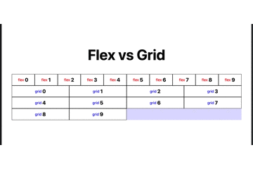

<blockquote class="twitter-tweet">
Flexで無理やりやってたことがGridで簡単にできることを今日知った <a href="https://t.co/Clg0XwkZDJ">pic.twitter.com/Clg0XwkZDJ</a>
&mdash; かじり@JavaScriptエンジニア (@kajirikajiri) <a href="https://twitter.com/kajirikajiri/status/1439834973377159174?ref_src=twsrc%5Etfw">September 20, 2021</a></blockquote> 